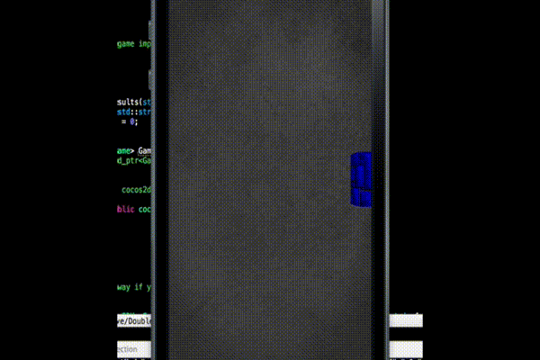

# Grid-Based Raycaster
A project that adapts the old-school raycast rendering algorithm to be used with [Cocos2d-x](http://cocos2d-x.org/). Used in games like Wolfenstein3D, Rise of the Triad, The Terminator: Rampage, Catacomb3-D, Super 3D Noah's Ark, and more.

All of the code is freely available from my GitHub [page](https://github.com/mikedotcpp).

# What is Raycasting?
[Raycasting](http://permadi.com/1996/05/ray-casting-tutorial-table-of-contents/) refers to an algorithm used by games like the original [Wolfenstein3D](https://en.wikipedia.org/wiki/Wolfenstein_3D) to sell the illusion of a first-person perspective.

The basic idea is to fire a bunch of rays from the player and draw whatever those rays hit. The number of rays to fire is equal to the number of vertical columns on screen (the pixel width of
the screen). For each ray that hits an object in the world (like a wall), a scaled vertical strip of that object is drawn.

DRAW AN IMAGE OF RAYCASTING HERE!

In this early experiement, I added a long delay during rendering so it's easier to see the screen filling from right to left, one vertical strip at a time. Vertical strips were created using
1 pixel wide quads.

While a promising start, I wanted to have the option of rendering floors/ceilings and be able to easily use some nice features of cocos - like actions, particle effects, etc. I started experimenting
with a slightly different approach...

# Raycasting, Cubed

Instead of drawing vertical strips per raycast, I decided to draw "blocks" per unique hit from a raycast. That is, draw cubes for each tile that a ray intersects with in projected 3D space.

Each cube is made from a `Sprite3D` object with 6 `Sprite`'s as children that each represent a different face. All faces are optional and completely independent, which means one block could
generate a cube with potentially 6 unique sides to it.

This gives me the flexibility I wanted in developing a unique look for maps. Video below:

You can see in the video that walls, floors, billboards and ceilings are rendered and that player can collect doors by walking into them. This was a convenient way to show how one might use the simple
`Behavior` system to attach a pickup behavior to door objects. It also suggests one might allow the player to change maps in realtime, a la a poor man's version of Minecraft.

Maps themselves are generated from a human-readable JSON text file. Much more on the format can be found [here](https://github.com/mikedotcpp/GridBasedRaycaster/wiki/Map-Format#overview).

# Just One More Thing...

By using the raycasting algorithm for visibility determination, I am able to leverage the 3D capabilities of Cocos2d-x to display a simple grid-based map in a first-person perspective. What would
happen if I could assign a 3D mesh to the `Sprite3D` container object? Video below:

This demo still utilizes the same raycasting technique from `CocosWolf3D`, but renders the results in a vastly different way. There's a lot going on here: 

## Instancing ##
I am using a technology called [instancing](https://www.khronos.org/registry/OpenGL-Refpages/es3.0/html/glDrawElementsInstanced.xhtml) to draw many similarly 
textured objects with little cost. The objects themselves are proper 3D meshes (of cubes) which are assigned to the `Sprite3D` container object at load time. Like the sprite-based version, these 
cubes can define unique textures for all 6 faces. *Note*: instancing requires an OpenGL ES extension for the 2.0 API and is included in 3.0 and above, therefore it may not be available on some
hardware.

## Lighting ##
The cube meshes rely on a slightly modified version of the stock 3D shader that comes with Cocos2d-x and has support for normal mapping, multiple light sources, and geometry instancing. This demo
makes use of ambient light, a spotlight, and a few point lights. 

## Reflections ##
You may have noticed the large columns seem to be reflected in the floor of the main chamber. This is a quick and dirty old-school trick at play: render the columns below the marble floor and 
change the alpha of the marble floor texture so that the columns are visible through it.

## Custom Shaders ##
Some tiles (like the lava tile) can have their own specialized shader that animates the texture sinusoidally.

## Variable Height Walls ##
Each map can define layers (called `Plane`'s) at different heights to give the illusion of walls with varying height. 

## Particles ##
The demo uses 3D particles that come with Cocos2d-x for a more dramatic effect. Used as-is, no changes necessary.

I hope you enjoyed reading about my approach to making a first-person perspective game using Cocos2d-x! These projects have been tested for Mac/iOS *only*. Code can be found:
* [CocosWolf3D](https://github.com/mikedotcpp/CocosWolf3D)
* [The Forgotten Tomb](https://github.com/mikedotcpp/TheForgottenTomb)
* [Grid Based Raycaster](https://github.com/mikedotcpp/GridBasedRaycaster)

Keep me in the loop with all your awesome creations, email me at mikedotcpp@gmail.com